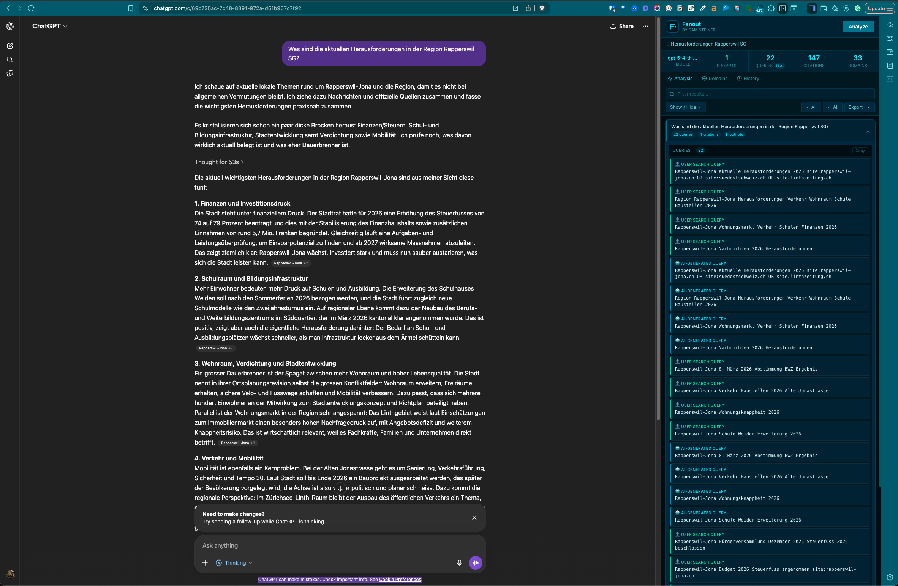

# Fanout – ChatGPT Query Analyzer

A Chrome/Firefox extension that opens as a side panel alongside ChatGPT and reveals everything happening under the hood of a conversation: what the model searched for, what it cited, which domains it trusted, and what entities it identified.

## What it shows

For each prompt in a conversation, Fanout extracts:

| Section | What it contains |
|---|---|
| **Queries** | Search queries the AI generated, and any user-provided search terms |
| **Grouped Citations** | Web results pulled in via ChatGPT's search (the "fanout") |
| **Primary Citations** | The ranked sources cited inline in the response |
| **Footnote Sources** | Sources referenced in footnotes |
| **Entities** | Named entities the model identified in the response |
| **Supporting Sites** | Secondary sources linked to primary citations |
| **Image Searches** | Image carousel queries generated during the response |

A stats bar at the top summarises the model used, prompt count, total queries, citations, and unique domains at a glance. The **Domains tab** aggregates all cited domains by frequency across the whole conversation.

## Install

> Fanout is not yet in the Chrome Web Store. Install it manually:

1. [Download ZIP](https://github.com/Magganpice/fanout/archive/refs/heads/main.zip) and unzip it — keep the folder somewhere permanent
2. Open `chrome://extensions`
3. Enable **Developer Mode** (toggle, top right)
4. Click **Load Unpacked** → select the unzipped `fanout` folder
5. Navigate to any ChatGPT conversation and click the Fanout icon in the toolbar

## Requirements

- Google Chrome 116+ (for Side Panel support)
- An active ChatGPT account
- A conversation that used web search — the URL must contain `/c/`

## Features

- **Side panel UI** — stays open alongside ChatGPT as you navigate between conversations
- **Chronological order** — prompts appear in the order they were sent
- **Show / Hide sections** — toggle individual data types on or off per session
- **Live filter** — search across all sections simultaneously
- **Domain Insights tab** — ranked frequency table of every cited domain, broken down by citation type
- **History tab** — last 20 analyzed conversations stored locally, loadable with one click
- **Export** — unified CSV, full JSON, or Markdown
- **Citation quality indicators** — flags citations with missing or thin snippets
- **Toolbar badge** — shows citation count on the extension icon after analysis

## Privacy

Fanout runs entirely in your browser. It makes no external requests of its own — it reads your ChatGPT conversation data using your existing session, and stores history locally in `chrome.storage.local`. Nothing leaves your machine.

## How it works

When you click **Analyze**, Fanout reads the current conversation from ChatGPT's internal API using your active session — the same data your browser already has. It then parses the conversation graph to extract search metadata, citation references, and entity markers from each message node, grouping everything by the prompt that triggered it.

## By Sam Steiner
